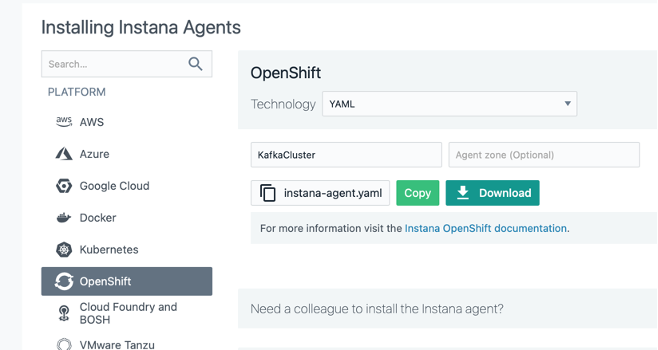
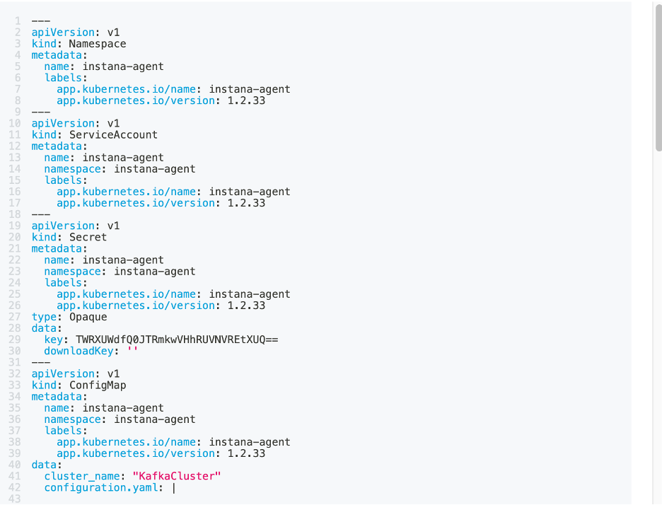
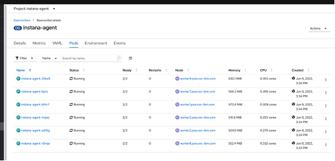

# Next steps

You can run on your own OpenShift cluster with existing assets and more assets available on the public Git repositories.
## Kafka Connector World

The Event Streams demonstration introduced the Kafka Connect framework, 


The real time inventory solution uses MQ source connector, with the Kafka connector cluster defined in [this kafka-connect.yaml file](https://github.ibm.com/boyerje/eda-tech-academy/blob/main/lab3-4/services/kconnect/kafka-connect.yaml) as:

```yaml
apiVersion: eventstreams.ibm.com/v1beta2
kind: KafkaConnect
metadata:
  name: std-1-connect-cluster
  annotations:
    eventstreams.ibm.com/use-connector-resources: "true"
spec:
  version: 3.0.0
  replicas: 2
  bootstrapServers: es-demo-kafka-bootstrap.cp4i-eventstreams.svc:9093
  image: quay.io/ibmcase/eda-kconnect-cluster-image:latest
  resources:
    limits:
      cpu: 2000m
      memory: 2Gi
    requests:
      cpu: 1000m
      memory: 2Gi
  template:
    pod:
      imagePullSecrets: []
      metadata:
        annotations:
          productChargedContainers: std-1-connect-cluster-connect
          eventstreams.production.type: CloudPakForIntegrationNonProduction
          productID: 2a79e49111f44ec3acd89608e56138f5
          productName: IBM Event Streams for Non Production
          productVersion: 11.0.0
          productMetric: VIRTUAL_PROCESSOR_CORE
          cloudpakId: c8b82d189e7545f0892db9ef2731b90d
          cloudpakName: IBM Cloud Pak for Integration
          cloudpakVersion: 2022.1.1
          productCloudpakRatio: "2:1"
  config:
    group.id: std-1-connect-cluster
    offset.storage.topic: std-1-connect-cluster-offsets
    config.storage.topic: std-1-connect-cluster-configs
    status.storage.topic: std-1-connect-cluster-status
    config.storage.replication.factor: 3
    offset.storage.replication.factor: 3
    status.storage.replication.factor: 3
  tls:
    trustedCertificates:
      - secretName: es-demo-cluster-ca-cert
        certificate: ca.crt
  authentication:
     type: tls
     certificateAndKey:
       certificate: user.crt
       key: user.key
       secretName: std-1-tls-user
```

And the source definition [kafka-mq-src-connector.yaml](https://github.ibm.com/boyerje/eda-tech-academy/blob/main/lab3-4/apps/mq-source/kafka-mq-src-connector.yaml)

you may need to go deeper with labs and best practices: 

* [a technical summary](https://ibm-cloud-architecture.github.io/refarch-eda/technology/kafka-connect/)
* [MQ connector lab](https://ibm-cloud-architecture.github.io/refarch-eda/use-cases/connect-mq/)
* [Deploy cloud object storage sink connector lab](https://ibm-cloud-architecture.github.io/refarch-eda/use-cases/connect-cos/)
* [Deploy a S3 sink connector using Apache Camel](https://ibm-cloud-architecture.github.io/refarch-eda/use-cases/connect-s3/)
* [Mirror maker 2.0 as a Kafka Framework solution](https://ibm-cloud-architecture.github.io/refarch-eda/use-cases/kafka-mm2/lab-2/)
* [Code source of the MQ source connector](https://github.com/ibm-messaging/kafka-connect-mq-source)
* [Code source of the Rabbit MQ connector](https://github.com/ibm-messaging/kafka-connect-rabbitmq-source) and [the matching lab](https://ibm-cloud-architecture.github.io/refarch-eda/use-cases/connect-rabbitmq/)
* [Code source of the JDBC sink connector](https://github.com/ibm-messaging/kafka-connect-jdbc-sink)

## Reactive Messaging Programming

Event-driven microservices adopt the [reactive manifesto](https://ibm-cloud-architecture.github.io/refarch-eda/advantages/reactive/#reactive-systems), which means use messaging as a way to communicate between components. When the components are distributed, Kafka or MQ are used as broker.

Microprofile Reactive Messaging is a very elegant and easier way to integrate with Kafka / Event Streams. The best support for it, is in Quarkus and [this reactive with kafka guide is a first read](https://quarkus.io/guides/kafka-reactive-getting-started). The Microprofile Reactive Messaging 1.0 is supported in OpenLiberty with Microprofile 3.0.

The code template in the [EDA quickstart repository](https://github.com/ibm-cloud-architecture/eda-quickstarts/) includes reactive messaging code template.
## The SAGA implementation

Long running process between microservice is addressed by the adoption of the SAGA pattern. You can read about the pattern in [this note](https://ibm-cloud-architecture.github.io/refarch-eda/patterns/saga/)

And visit the [Choreography implementation done with, Event Streams, Reactive Programming here](https://ibm-cloud-architecture.github.io/eda-saga-choreography/)

* [Order microservice keeping SAGA coherence - git repository](https://github.com/ibm-cloud-architecture/refarch-kc-order-cmd-ms)
* [Reefer microservice participant to the SAGA - git repo](https://github.com/ibm-cloud-architecture/refarch-kc-reefer-ms)
* [Voyage microservice SAGA participant - git repo](https://github.com/ibm-cloud-architecture/refarch-kc-voyage-ms)

The [orchestration implementation with, Event Streams, Reactive Programming here](https://ibm-cloud-architecture.github.io/eda-saga-orchestration/)

## Change data capture with Debezium and Outbox pattern

Very [interesting lab with Debezium](https://ibm-cloud-architecture.github.io/refarch-eda/use-cases/db2-debezium/) using outbox pattern.
## Full GitOps story

To get a better understanding of the EDA gitops process [see this technical note](https://ibm-cloud-architecture.github.io/refarch-eda/use-cases/gitops/) and reuse the following git repostiories:

* [EDA GitOps Catalog](https://github.com/ibm-cloud-architecture/eda-gitops-catalog)
* [RT inventory gitops](https://github.com/ibm-cloud-architecture/eda-rt-inventory-gitops)

## Instana monitoring 

Deploying Instana APM on the Event Streams Cluster running on Openshift/kubernetes.

* Create the instana-agent project and set the policy permissions to ensure the instana-agent service account is in the privileged security context.

```sh
oc login -u system:admin
oc new-project instana-agent
oc adm policy add-scc-to-user privileged -z instana-agent
```

* Login to Instana console: [https://training-kafka.instana.io](https://training-kafka.instana.io)
* Click on Deploy agent on the Top right corner


Select OpenShift and enter the desired ClusterName/ClusterID that needs to be monitored with Instana. You find the clusterID from Openshift console.

Download the yaml file generated by Instana



Navigate to` Openshift -> Workloads -> DeamonSets` and import the instana-agent.yaml and create the deamonset per each of the document streams inside the yaml separately. 

For example, since we already created the name space and serviceaccount in Step1, we can skip the first two documents below and start from Kind:secret.



Once DeamonSet has been successfully created, validate that the pods are running suceessfully, wait for 5 minutes for instana to automatically discover the kafka components and instrument them.


