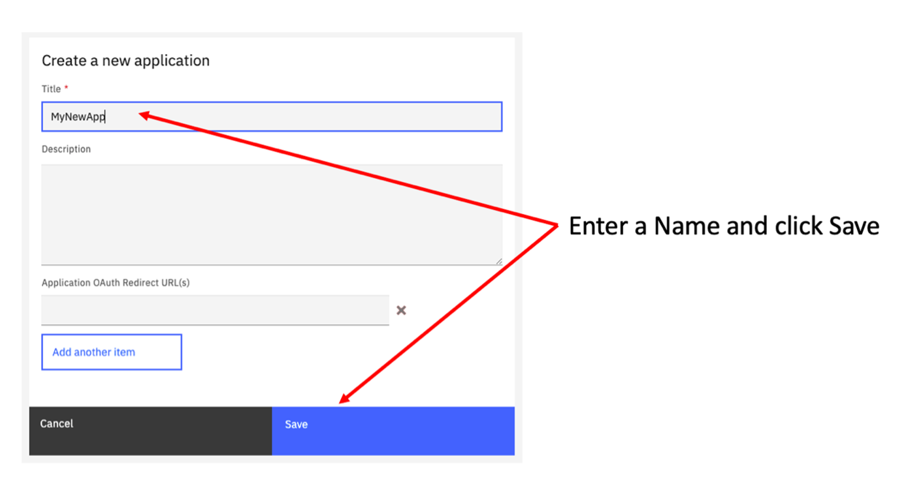
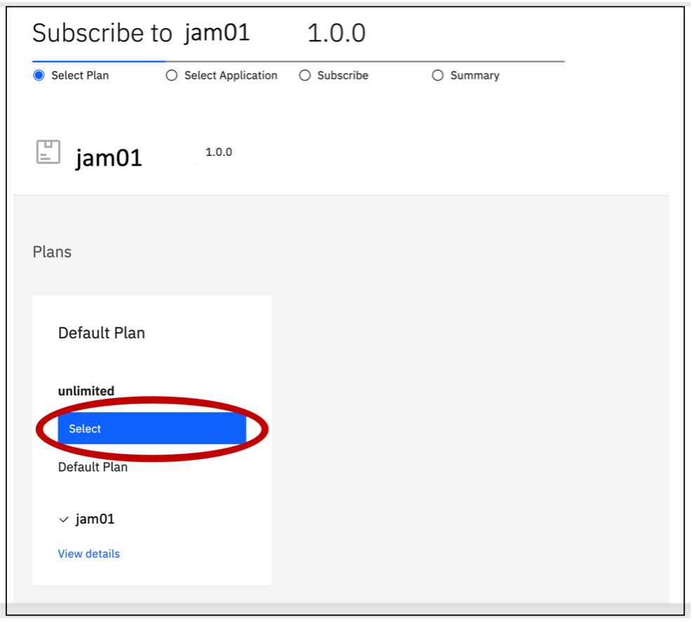
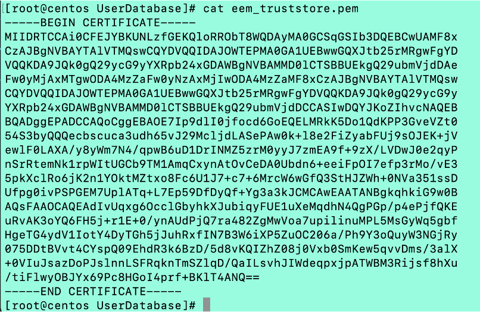

# Event end point management

## About this Lab

In this lab, you will learn:

* The Developer capability to subscribe to topics easily from EEM.  
* Consume messages from topics via EEM 

???- "References:"
    EEM:  [https://www.ibm.com/docs/en/cloud-paks/cp-integration/2021.4?topic=capabilities-event-endpoint-management-deployment](https://www.ibm.com/docs/en/cloud-paks/cp-integration/2021.4?topic=capabilities-event-endpoint-management-deployment)

## Lab Prerequisites

1.	Access to a API Connect Developer Portal  
2.	The KafkaClient used in the Schema Registry lab. 

## Lab Procedures

1.	Open the Developer portal (link provided in table below) and create a login for yourself [if this is the first time you are logging in]. If you already have a username created, login. For users who are creating the login for the first time, you will receive an email for confirmation. 
Please use one of these URLs to access the Developer Portal:

    | Host | URL |
    | --- | --- |
    | Mandalorian | [Mandalorian API Portal](https://apim-demo-ptl-portal-web-cp4i-apic.apps.mandalorian.coc-ibm.com/mandalorian-admin-porg/sandbox) |
    | Cody| [Cody API portal](https://apim-demo-ptl-portal-web-cp4i-apic.apps.cody.coc-ibm.com/cody-admin-porg/sandbox) |
    | Grievous | [Grievous API portal](https://apim-demo-ptl-portal-web-cp4i-apic.apps.grievous.coc-ibm.com/grievous-admin-porg/sandbox) |  

2. Create an App.

    Go to Apps and Click on “Create a new app”. 

    

    Enter a name and click on save.

    

    The API Key and secret will be provided. Take note of it and close the box.
    
    The new app has been created. You can optionally click on ‘Verify’ and enter the secret copied to ensure the credentials you copied are correct. 

3.	Subscribe to the Product and get connectivity details.   

    In the main portal, Go to "API Products".   
    
    Look for a topic and Click on it.

    

    Take note of the connectivity details and click on "Get Access". 
    Refer to the steps in the image below. 
    
    Take note of the following: 

    ```
    topic, bootstrap_server, client_id, sasl_mechanism and security_protocol. 
    ```

    These fields will be needed to establish connection to the EventStreams via EEM. 


    

    

    Click on “Select”.

    Click on the newly created app and proceed to complete the subscription process.

    
    
    You have now subscribed to a topic. 

4.	Create the PEM certificate needed while accessing the EEM.

    Run this command from a terminal. 

    ```sh
    echo | openssl s_client -connect BOOTSTRAP-URL:PORT -servername BOOTSTRAP-URL
    ```

    Example:

    ```sh
    openssl s_client -connect apim-demo-myegw-event-gw-client-apic.apps.cody.coc-ibm.com:443 -servername apim-demo-myegw-event-gw-client-apic.apps.cody.coc-ibm.com
    ```

    The BOOTSTRAP-URL is the bootstrap_server URL obtained in step 3. 

    Copy the output lines between BEGIN CERTIFICATE and END CERTIFICATE to a file called eem_truststore.pem. The file should look like this:

    

    Copy the file to `C:\TechJam\EventStreams_Lab\KafkaClient_YYYYMMDD\`


    !!! note
        If you do not have openssl installed in your computer or if you are unable to run the openssl command, you may use this for the PEM certificate. Copy and save one of the following (depending on the Openshift cluster you are using) as eem_truststore.pem. 

5. Test consuming the data in the topic you have just subscribed using the KafkaClient that you used for the Schema Registry lab.

    * Make a backup copy of the config.properties file in the following folder: `C:\TechJam\EventStreams_Lab\KafkaClient_YYYYMMDD\`
    * Edit the config.properties file and make the following changes. 


    | Field	| Value |
    | --- | --- |
    | enableschemaavro	| false |
    | bootstrap.servers	| Enter the bootstrap_server URL obtained in step 3. |
    | sasl.jaas.config	| Paste this string. Replace the <API_KEY\> and <SECRET\> with the details you obtained in step 2. org.apache.kafka.common.security.plain.PlainLoginModule required username='<API_KEY\>' password='<SECRET\>'; |
    | sasl.mechanism	| PLAIN |
    | security.protocol	| SASL_SSL |
    | topic	 | Name of the topic to consume (obtained in step 3) |
    | ssl.truststore.location	| Point it to the location of the PEM file eem_truststore.pem |
    | ssl.truststore.type	| PEM | 
    | client.id	| Insert the client ID obtained from step 3. |

    The other fields can be left as it is. 

    * Now you can run the KafkaClient to consume data. 

    ```sh
    cd C:\TechJam\EventStreams_Lab\KafkaClient_YYYYMMDD\ 
    java -jar KafkaClient.jar consumer config.properties
    ```

    You should see messages being consumed. 

    !!! note
         EEM can only be used for consuming data. Not for producing data. 
