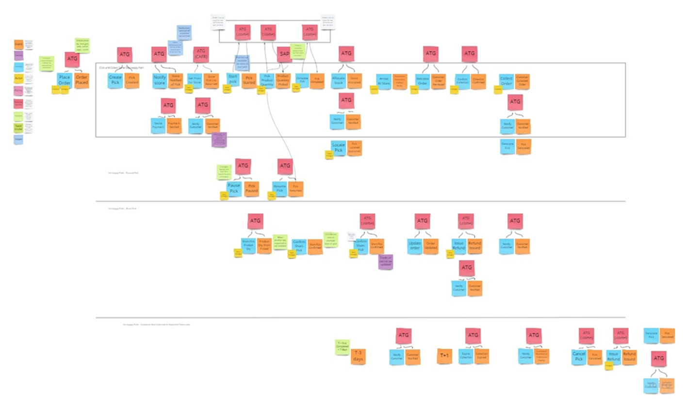

# Real-time inventory 

This use case is coming from four customer's requests on the last 3 years. 

## Problem statement

Today, a lot of companies which are managing item / product inventory are facing real challenges to get a close to real-time view of item availability and global inventory view. The solution can be very complex to implement while integrating Enterprise Resource Planning products and other custom legacy systems.

Customer is asking you to present how to address this problem using an event-driven architecture 
and cloud native microservices. 

Normally to do MVP we propose Event Storming and the image below is an example of the outcomes of such event storming session.  

MVP will be complex to implement, but the customer wants first to select a technology, so a proof of concept needs to be done to guide them on how our product portfolio will address their problems.
## Exercise 1: system design

Giving the problem statement above, how do you design this solution and what do you propose to the customer to do a proof of concept for.

Start from a white page, design components that you think will be relevant.

**Duration**: 30 minutes

**Expected outcome**

* A diagram illustrating the design. If you use Visual Code you can get the [drawio plugin](https://marketplace.visualstudio.com/items?itemName=hediet.vscode-drawio)
* Some questions you would like to see addressed

### Some information you gathered from your framing meeting

* SAP is used to be the final system of records
* Company has multiple stores and Warehouse
* Stores and warehouses have local view of their inventory on local servers and cash machines. 
* Some inventory for warehouses and transaction are done in mainframe and shared with IBM MQ
* Item has code bar and SKU so people moving stock internally can scan item so local system may have visibility of where items are after some local latency.
* Customer has heard about kafka
* Architect wants to deploy to the cloud
* SAP system will stay in enterprise
* Architect wants to use data lake solution to let data scientists develop statistical and AI  models.

???- "Guidances"
    * Do not read !
    * Think about enterprise network, cloud provider, stores and warehouses as sources.
    * SAP is one of the system of records

> [See the Solution](./lab1-sol.md)