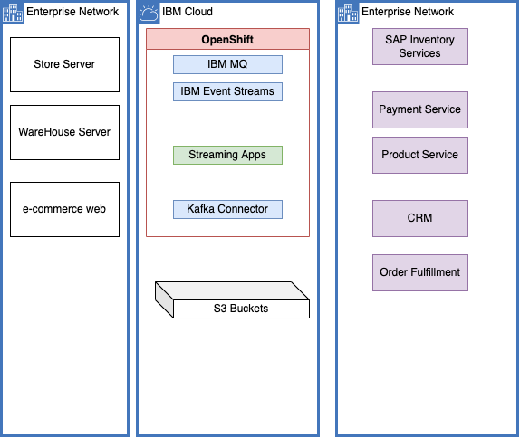

# Lab 1 solution

The system design of the proof of concept should be simple, but not the global solution, and in the presale work we have to pitch a higher view of what the solution may look like so customer's feels confortable about how your proof of concept solution will fit in a bigger solution.

## Global solution view of real-time inventory

The core principle, is that each components responsible of managing some inventory elements will push event about their own inventory update to a central data hub, that will be used to update back ends, ERP, systems but also exposed data so it will be easy to plug and play streaming processing for computing different aggregates.

The following figure is such high level business view.

Servers in the Store are sending sale transactions to a central messaging platform, where streaming components are computing the different aggregates and are publishing them to other topics. This is a classical data streaming pipeline. Sink connectors, based on Kafka Connect framework, may be used to move data to long persistence storage like a Database, integrate results back to Legacy ERP

???- "More information"
    * If you want to reuse the diagram the source is at [this url](https://github.ibm.com/boyerje/eda-tech-academy/blob/main/docs/diagrams/hl-solution.drawio)

## Demos / proof of concept view
