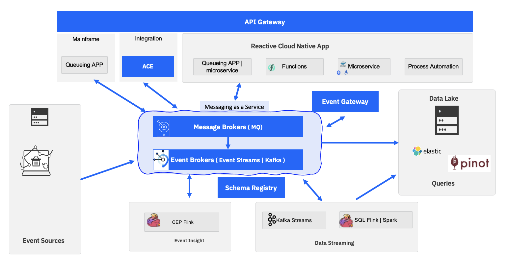

# Real-time inventory system design proposal

The system design of this proof of concept should be simple, but not the global solution, and in the presale work we have to pitch a higher view of what the solution may look like so customer's feels confortable about how your proof of concept solution will fit in a bigger solution.

## Global solution view of real-time inventory

The core principle, is that each components responsible of managing some inventory elements will push events about their own inventory updates to a central data hub, that will be used to update back ends, ERP, systems.

This central event backbone also exposes data so it will be easy to plug and play streaming processing for computing different statistical aggregates.

The following figure is such high level business view of what a solution looks like

Servers in the stores and warehouses  (*Store Server* and *Warehouse Server* ) are sending sale transactions or item restock messages to a central messaging platform, where streaming components (the green components) are computing the different aggregates and are publishing those aggregation results to other topics. 

The architecture decision is to adopt loosely coupling component, asynchronous communication, being able to scale horizontally and be resilient. A pub/sub model is used, where components can start consuming messages long time after they were published, or immediately after.

The system design is based on the lambda architecture, a classical data streaming pipeline architecture, as presented in IBM EDA reference architecture:

Streaming applications work as consuming events, processing them and producing new events in different topic. Those applications will guaranty exaclty once delivery, so it will help for inventory consistency.

IBM MQ and IBM Event Streams are used to support a shared message as a services architecture where any asynchronous communication between applications is supported.

We want to use MQ to get messages from mainframe applications or  MDB JEE apps. MQ Streaming Queue or queue to queue replication will help moving those messages to the OpenShift cluster. 

MQ Source kafka connector will be used to inject to Event Streams topic. A `items` topic will be used to receive transactions about items as a restock or sale events.

Sink connectors, based on Kafka Connect framework, may be used to move data to long persistence storage like s3 bucket, datalake, Database,... or to integrate back to Legacy ERP systems.

The Enterprise Network column includes the potential applications the data pipeline is integrated with.

???- "More information"
    * If you want to reuse the diagram the source is at [this url](https://github.com/ibm-cloud-architecture/eda-tech-academy/blob/main/docs/diagrams/hl-solution.drawio)
    * [EDA reference architecture presentation](https://ibm-cloud-architecture.github.io/refarch-eda/introduction/reference-architecture/#event-driven-architecture) and argumentations
    * [Kappa architecture](https://ibm-cloud-architecture.github.io/refarch-eda/introduction/reference-architecture/#kappa-architecture)

## Demos / proof of concept view

Now that you have positionned a high level view, for the proof of concept, you want to leverage the cloud pak for integration packaging, and use at least MQ, Kafka Connector, Event Streams, streaming application, and a sink to cloud object storage or AWS S3.

You want to demonstrate MQ as a source for message coming from warehouses. Those messages are sent to Event Streams topic via kafka connector.

You may need to simulate store or warehouse events and you can use simple json files for that and the kafka-console-producer.sh shell you can get from any Kafka deployment. You can also leverage the [Store Simulator](https://github.com/ibm-cloud-architecture/refarch-eda-store-simulator) asset that can send messages to MQ, Kafka or RabbitMQ, random messages, or controlled scenario. This is what we will use in lab 3.

You will deploy a kafka connector cluster with MQ source connector and different sink connector like elastic search or cloud object storage bucket.

The following figure illustrates what a proof of concept may look like. Obviously you can reuse IBM demo for that:

Next lab will teach you how to develop the `store inventory` with Kafka Streams to compute item inventory cross stores.

???- "More information"
    * The [store simulator application](https://github.com/ibm-cloud-architecture/refarch-eda-store-simulator) is a Reactive Messaging Java app, which generates item sales to different possible messaging middlewares ( RabbitMQ, MQ or directly to Kafka). The code of this application is in this https://github.com/ibm-cloud-architecture/refarch-eda-store-simulator. If you want to browse the code, the main readme of this project includes how to package and run this app with docker compose, and explains how the code works. The docker image is [quay.io/ibmcase/eda-store-simulator/](https://quay.io/ibmcase/eda-store-simulator)
    * The item inventory aggregator is a Kafka Stream application, done with Kafka Stream API. The source code is in [the refarch-eda-item-inventory project](https://github.com/ibm-cloud-architecture/refarch-eda-item-inventory). Consider this more as a black box in the context of the scenario, it consumes items events, aggregate them, expose APIs on top of Kafka Streams interactive queries and publish inventory events on `item.inventory` topic. 
    * The store inventory aggregator is a Kafka Stream application, done with Kafka Stream API. The source code is in [the refarch-eda-store-inventory project](https://github.com/ibm-cloud-architecture/refarch-eda-store-inventory) the output is in `store.inventory` topic. 
