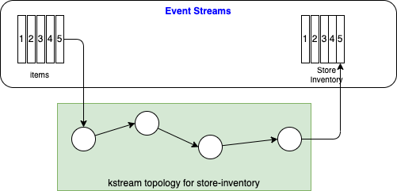

# Lab 2: Store inventory with Kafka Streams

In this Lab you will do a simple Kafka Streams processing using simple APIs to build a streaming topology to compute the store inventory for each items.

The figure illustrates what you need to build, the green rectangle, which is a [Java Quarkus](https://quarkus.io) application using Kafka Streams API consuming `items` events and computing `store inventory` events by aggregating at the store level.



In fact, most of the code is ready for you for this application, the lab is really to go over simple Streaming implementation and doing so, step by step.

## Problem

The [ItemTransaction.java](https://github.ibm.com/boyerje/eda-tech-academy/blob/main/lab2/refarch-eda-store-inventory/src/main/java/ibm/gse/eda/stores/domain/ItemTransaction.java) represents the message structure of the input topic. Below is an extract of this definition:

```java
public class ItemTransaction   {
        public static String RESTOCK = "RESTOCK";
        public static String SALE = "SALE";
        public Long id;
        public String storeName;
        public String sku;
        public int quantity;
        public String type;
        public Double price;
        public String timestamp;
```

We need to compute aggregate for each store and item current stock. For example Store-1 has 20 Item-1 and 30 Item-2.
Events could be RESTOCK or SALE. The `type` attribute defines this. `sku` represents the item identifier.

The input topic is `items` and the output topic is `store.inventory`. We assume ItemTransaction fields are all present.

* What is the data model you need to use to keep store inventory?
* What event will be produced to the `store.inventory` topic?
* Design a Kafka Stream topology to compute those aggregate

If you need to refresh or learn more on Kafka Streams go to [this note](./kstream.md) and do the small exercises that will help you implement this topology.
## Some more information

* We need to process 5 million messages per day. Day is from 6:00 am to 10 pm every day.

???- "Some hints"
    * Use [Ktable](./kstream/#ktable) to keep store data.
    * Use [KStream aggregate function](./kstream/#kstream)

## Instructions

* Go to the `lab2/refarch-eda-store-inventory` folder
* Code organization use the `onion` architecture introduced in the Domain-driven design.

    * `domain` contains the business logic and business entities related to item transaction and store inventory.
    * `infra` is for infrastructure code, containing JAXRS class, event processing, and ser-des.

* If you have done the [Kstream getting started](./kstream.md) session, you may have use the TopolofyTestDriver and unit testing topology. You will do the same with the 

Most of the work will be in the testing classes so you can progress incrementally, and use a very cool API called TopologyTestDriver to test your topology without any Kafka Broker or Java app, just unit tests. But you could package the application and deploy it to OpenShift.

