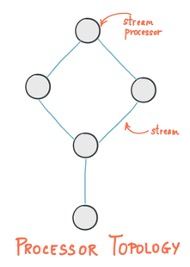
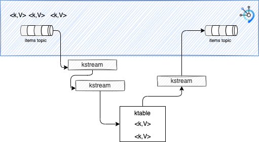
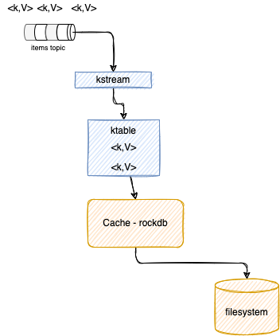

You need to understand some basic on how to use the [Kafka Stream APIs](https://kafka.apache.org/20/documentation/streams/developer-guide/) so you can develop some simple streaming applications in a scope of a proof of concept.

## Kafka Stream concepts

Any Java or Scala application can use Kafka Streams APIs.
### Topology

The business logic is implemented via a Kafka Streams "topology" which represents a graph of processing operators or nodes. Each node within the graph, processes events from the parent node and may generate events for the down stream node(s). 
This is really close to the Java Streaming APIs or Mutiny APIs, but the APIs used by the topology is from Kafka Streams APIS.

Kafka Streams applications are built on top of Kafka producer and consumer APIs and are leveraging Kafka capabilities to do data parallelism processing, to support distributed coordination of partition to task assignment, and to support fault tolerance. In Java the streaming topology will be executed in multiple threads and explicitly started in the Java app.

```java
  Properties props = buildKafkaProperties();
  kafkaStreams = new KafkaStreams(buildProcessFlow(), props);
  kafkaStreams.start();
```

To build a topology we use a StreamsBuilder class to define the input streams (mapped to a Kakfa topic), the logic to apply to the events and then how to produce results to a Kafka topic.

```Java title="Define a topology"
// Create a builder
final StreamsBuilder builder = new StreamsBuilder(); // (1)
// define the KStream abstraction by defining where the data come from (topic) and in which format
KStream<String,ItemTransaction> items = builder.stream(itemSoldInputStreamName, 
        Consumed.with(Serdes.String(),  StoreSerdes.ItemTransactionSerde()));  // (2)
final Topology topology = builder.build();
// start the topology in a thread... we will this code later
```

1. StreamsBuilder to build a topology and run it
1. Define a stream from a topic with serialization of the value to a Java Bean

The following figure illustrates the topology concept:



So let start by learning more about KStream construct.

???- "More Reading"
    * If you do not know about topic, kafka producer, and consumer, you may spend time to read some quick [kafka concepts](https://ibm.github.io/event-streams/about/key-concepts/)
    * More [about producer practice](https://ibm.github.io/event-streams/about/producing-messages/)
    * And [consumer](https://ibm.github.io/event-streams/about/consuming-messages/)
    * More [advanced practices for producer](https://ibm-cloud-architecture.github.io/refarch-eda/technology/kafka-producers/) and [consumer](https://ibm-cloud-architecture.github.io/refarch-eda/technology/kafka-consumers/)
### KStream API

[KStream](https://kafka.apache.org/30/javadoc/org/apache/kafka/streams/kstream/KStream.html) is an abstraction of a Kafka record stream. It can be defined from one ot multiple Topics, and will define the structure of the Kafka record key, and the record structure.

The following declaration is for consuming from topic named `items` with Key and Value of type `String`:

```java
 KStream<String, String> aStream = builder.stream("items",Consumed.with(Serdes.String(), Serdes.String()));
```

Then Kstream offers a lot of functions to process the records. Below is a quick summary of the methods you may need to use in the next exercises:

| Method | What it does | Example |
| --- | --- | --- | 
| **peek** | Perform an action on each record of KStream. | aStream.peek((key, value) -> System.out.println(value) |
| **to** | transform the stream to a topic | aStream.to(outTopicName) |
| **filter** | Create a new KStream with records which satisfy the given predicate. |  .filter((key, value) -> ("BLUE".equalsIgnoreCase(value))) |
| **split** | Split this stream into different branches. | aStream.split().branch((key, value) -> value.userId == null, Branched.as("no-userid")).defaultBranch(Branched.as("non-null"));|
| **groupBy** | Group the records of this KStream on a new key  | |
| **groupByKey** | | |
| **[KGroupedStream](https://kafka.apache.org/30/javadoc/org/apache/kafka/streams/kstream/KGroupedStream.html)** | Intermediate representation of a KStream in order to apply an aggregation operation | Ouput of groupByKey |
| [aggregate](https://kafka.apache.org/30/javadoc/org/apache/kafka/streams/kstream/KGroupedStream.html#aggregate) | Aggregate the values of records in this stream by the grouped key | |

### KTable

[KTable](https://kafka.apache.org/30/javadoc/org/apache/kafka/streams/kstream/KTable.html) is the second main abstraction of a changelog stream from a primary-keyed table. Each record in this changelog stream is an update on the primary-keyed table with the record key as the primary key.

A stream can be considered a changelog of a table, where each data record in the stream captures a state change of the table.

The figure below is a simplication of both concepts:



A **Kstream** is first connect to a topic and will receive events with Key,Value structure, as unbounded stream. You can chain Kstream to build a topology, and to a Ktable, which will keep only the last value of a given key. To ouput to a Kafka topic, the final construct is a KStream.

KStreams are in memory, Ktables are also in memory by may be persisted. KTable assumes that records from the source topic that have null keys are simply dropped.

KTable can be created directly from a Kafka topic (using StreamsBuilder.table operator), as a result of transformations on an existing KTable, or aggregations (aggregate, count, and reduce). 


Stateful transformations depend on state for processing inputs and producing outputs and require a state store associated with the stream processor. For example, in aggregating operations, a windowing state store is used to collect the latest aggregation results per window.

KTables need to additionally maintain their respective state in between events so that operations like aggregations (e.g., COUNT()) can work properly. 

Every ktable has its own state store. Any operation on the table such as querying, inserting, or updating a row is carried out behind the scenes by a corresponding operation on the table’s state store.

These state stores are being materialized on local disk inside your application instances. 

Kafka Streams uses [RocksDB](https://github.com/facebook/rocksdb/wiki) as the default storage engine for persistent state stores. RockDB is a fast key-value server, especially suited for storing data on flash drives.

The following figure summarizes all those concepts:



There are as many caches as there are threads, but no sharing of caches across threads happens. Records are evicted using a simple LRU scheme after the cache size is reached. 
The semantics of caching is that data is flushed to the state store and forwarded to the next downstream processor node whenever the earliest of `commit.interval.ms` or `cache.max.bytes.buffering` (cache pressure) hits.
As illustrated in the example [TestAccumulateItemSoldWithCaching]() when using cache, records are output at the end of the commit interval or when reaching max buffer size.

Interesting methods:

| Method | What it does | Example |
| --- | --- | --- | 
| **filter** | Create a new KTable that consists of all records of this KTable which satisfy the given predicate| |
| **join** | join streams with tables or table to table | | 


???- "Read more"
    * [Apache Kafka - TUTORIAL: WRITE A KAFKA STREAMS APPLICATION](https://kafka.apache.org/31/documentation/streams/tutorial)
    * [KStream API](https://kafka.apache.org/30/javadoc/org/apache/kafka/streams/kstream/KStream.html)
    * [Ktable API](https://kafka.apache.org/30/javadoc/org/apache/kafka/streams/kstream/KTable.html)
    * [Kafka Streams summary](https://ibm-cloud-architecture.github.io/refarch-eda/technology/kafka-streams/)
    * [Other labs](https://ibm-cloud-architecture.github.io/refarch-eda/use-cases/kafka-streams/)

