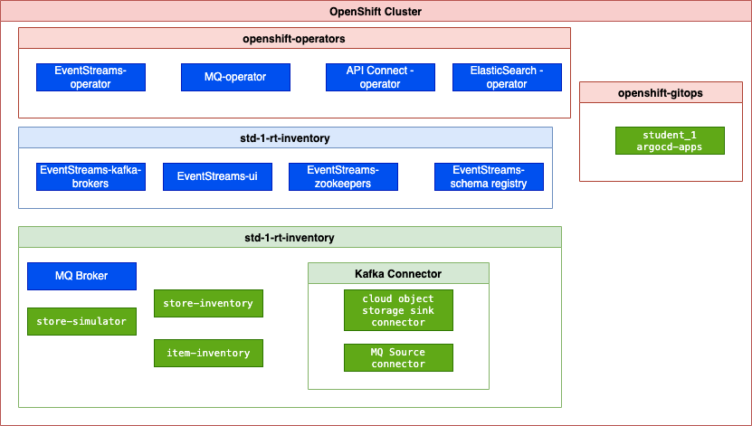

# Lab 3: Item inventory demonstration deployment

In this lab, you will learn how to modify the configuration of the different services of a real-time inventory demo and how to deploy the solution
using OpenShift GitOps and a GitOps approach.

Each Student will have received a unique identifier and will modify the current settings in this folder with their student id. 
All the current configurations are currently set for `student_1`.

We assume the following are pre-set in you OpenShift cluster:

* API Connect is installed under `cp4i-apic` project
* Event Streams is installed under `cp4i-eventstreams` project

## pre-requisites

* Have a [git client installed](https://github.com/git-guides/install-git)
* Have make installed. On Mac it should be pre-installed, on Windows [install GnuWin](http://gnuwin32.sourceforge.net/install.html)
* You need the 'oc cli'

## Preparation

As we are using GitOps, you need to have the source of the configuration into your own account.

1. Fork the current repository to your github account: 

    ```sh
    chrome "https://github.com/ibm-cloud-architecture/eda-rt-inventory-gitops"
    ```

1. Then clone it to your laptop

    ```sh
    git clone https://github.com/<github-account>/eda-rt-inventory-gitops
    ```

1. Verify the OpenShift GitOps Operator is installed on your OpenShift cluster.

    Work in the `eda-rt-inventory-gitops/environments/multi-tenancy/student` folder.

    ```sh
    make verify-argocd-available
    ```

    Should get this output if not installed

    ```sh
    Installing
    Complete
    ```

    Or this one if already installed.

    ```sh
    openshift-gitops-operator Installed
    ```

Ready to modify the configurations.


## Modify existing configuration

We will prepare the configuration for the following green components in figure below:



The blue components should have been deployed with the Cloud Pak for Integration deployment. 

*If you are student-1 there is nothing to do, you were lucky...*

We propose two ways to do this lab, one using a script that will run all the update automatically, or one using a step-by-step approach where student should be able review the existing configuration and understand the modification to be done.

1. The demonstration will run on its own namespace. The `env/base` folder includes the definition of the namespace, roles, role binding needed to deploy the demonstration. This is a classical way to isolate apps in kubernetes. You need to modify those yaml files according to your student id. Two main naming conventions are used: `student-XX` for user name id XX, and `std-XX` prefix. So the namespace for Student-2 will be `sdt-2-rt-inventory` namespace. 

    * **Automatic way:**

    ```sh
    export USER_NAME=student-2
    export PREFIX=std-2
    export GIT_REPO_NAME=<your-git-user-id>
    make prepare_ns
    ```

    * **Manual way:** go over each of the following files `argocd-admin.yaml, service-account.yaml, cp-secret.yaml,	role.yaml, rt-inventory-dev-rolebinding.yaml`  in `env/base` folder to change the namespace value and for the `cp-secret.yaml` modify the `jq -r '.metadata.namespace="std-1-rt-inventory"'` in line 16 with the expected namespace. The `cp-secret` job help to copy entitlement-key so we can run MQ Broker in the same namespace as the solution. 


1. Prepare the ArgoCD app and project: Each student will have his/her own project within ArgoCD.

    * **Automatic way:**

    ```sh
    # same exported variables as before
    make prepare-argocd
    ```

    * Manual way: update the namespace, project, and repoURL elements in the `argocd/*.yaml` files.

1. Commit and push your changes to your gitops repository

    ```sh
    git commit -am "update configuration for my student id"
    git push 
    ```

1. Bootstrap Argocd:  

    ```sh
    make argocd
    # Or use 
    oc apply -f
    ```

1. To get the `admin` user's password use the command

    ```sh
    oc extract secret/openshift-gitops-cluster -n openshift-gitops --to=-
    ```

1. Get the ArgoCD User Interface URL and open a web browser

   ```sh
   chrome https://$(oc get route openshift-gitops-server -o jsonpath='{.status.ingress[].host}'  -n openshift-gitops)
   ```


