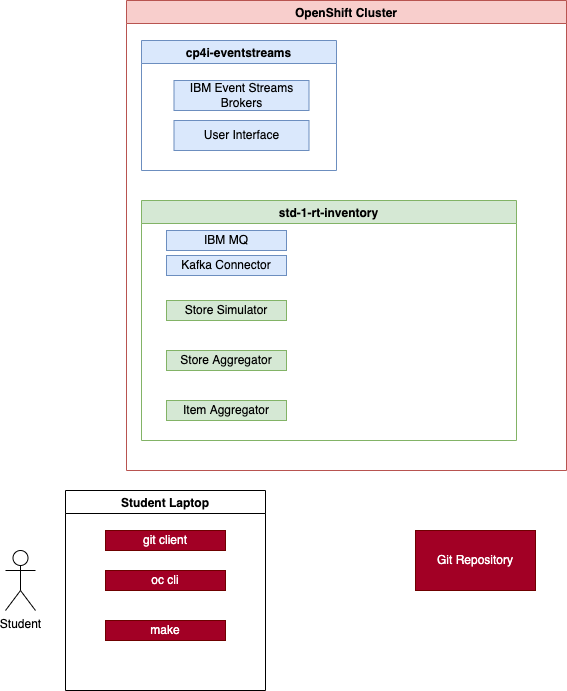
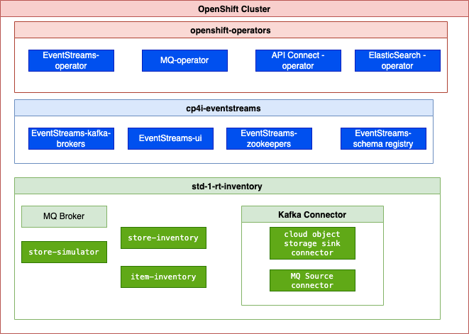

# Lab 3: Item inventory demonstration deployment

In this lab, you will learn how to deploy the solution by simply using this repository and a minimum set of commands.

Each Student will have received a unique identifier and will modify the current settings in this folder with their student id. 
All the current kubernetes configurations are currently set for `student-1`, prefix: `std-1`.

We assume the following are pre-set in you OpenShift cluster, which is the same as CoC integration cluster:

* Platform navigator is deployed in `cp4i` project.
* API Connect is installed under `cp4i-apic` project.
* Event Streams is installed under `cp4i-eventstreams` project.

The following diagram illustrates the components we will deploy in the student namespace using this repository.


## pre-requisites

See [Pre-requisites section](../#pre-requisites)

## Preparation

1. Login to your OpenShift cluster using the login command from the OpenShift Console

    

    Then copy this line:

    
    
1. Verify your `oc` cli works

    ```sh
    oc get nodes
    ```

## Modify existing configuration

We will prepare the configuration for the following green components in figure below:



The blue components should have been deployed with the Cloud Pak for Integration deployment. 

*If you are student-1 there is nothing to do, you were lucky...*

1. The demonstration will run on its own namespace. The `env/base` folder includes the definition of the namespace, roles, role binding needed to deploy the demonstration. This is a classical way to isolate apps in kubernetes. 

    Running the `updateStudent.sh` shell script, will modify all the yaml files used by the solution with your student id. Two main naming conventions are used: `student-XX` for user name id XX, and `std-XX` prefix. So the namespace for Student-2 will be `sdt-2-rt-inventory` namespace. 

    ```sh
    export USER_NAME=student-2
    export PREFIX=std-2
    ./updateStudent.sh
    ```

## Deploy

The deployment will configure topics in event streams, deploy the three apps, MQ broker and Kafka Connect cluster with the MQ source connector.


*Event Gateway, schema registry, and Cloud Object Storage sink connector are not used*

1. Start the deployment

    ```sh
    make all-no-gitops
    ```

1. Verify the solution is up and running

    ```sh
    oc project std-1-rt-inventor
    oc get pods
    oc get routes 
    oc get kafkatopic -n cp4i-eventstreams
    oc get kafkauser -n  cp4i-eventstreams
    ```
1. Access to the MQ console

1. Access to the simulator console

    ```sh
    chrome http://$(oc get route store-simulator -o jsonpath='{.status.ingress[].host}')
    ```
1. Access MQ web cosole

    ```sh
    chrome   https://cpd-cp4i.apps.biggs.coc-ibm.com/integration/messaging/std-1-rt-inventory/store-mq-ibm-mq/
    ```
1. Execute the demo script

    [The demonstration instructions are in a separate note](https://ibm-cloud-architecture.github.io/refarch-eda/scenarios/realtime-inventory/#demonstrate-the-real-time-processing) as this is a demonstration available in the public git and shareable with customers and prospects.


## Clean 

1. If you plan to do the lab 4 using gitops do not delete anything

1. Full clean up the deployment

    If you want to stop working and clean the OpenShift cluster and event streams elements

    ```sh
    make clean-all
    ```

> [Next to deploy with GitOps](../lab4)