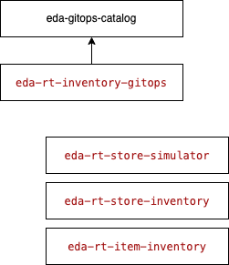
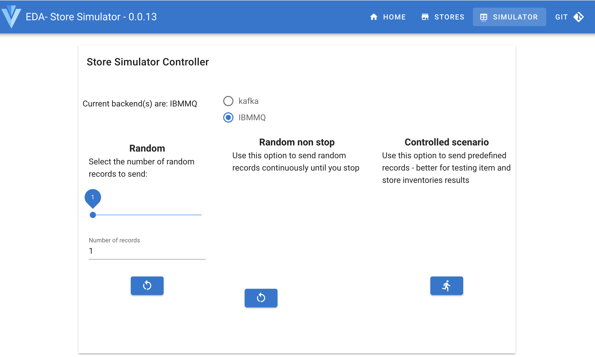
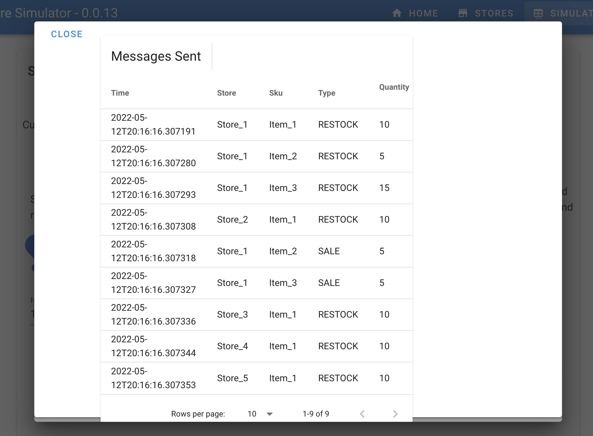

# Lab 3: Item inventory demonstration deployment

**Duration: 20 minutes**

## Goals

In this lab, you will learn how to deploy the solution by simply using this repository and a minimum set of commands. The approach is to present reusable structure you may want to reuse for your own future proof of concept, so it will be easy to demonstrate your solution.

The following diagram illustrates the components we will deploy in the student namespace using this repository.


### More context

A traditional solution may be organized with one git repository per application, and at least one GitOps repository to define the deployment artifacts. If you look at the demonstration you are running in this lab, the source code is in the public git account [ibm-cloud-architecture](https://github.com/ibm-cloud-architecture) with other repositories the following structure:



* [eda-rt-inventory-gitops](https://github.com/ibm-cloud-architecture/eda-rt-inventory-gitops): this gitops repo, built with [kam cli](https://github.com/redhat-developer/kam) and includes everything to use ArgoCD apps to deploy the solution
* [eda-gitops-catalog](https://github.com/ibm-cloud-architecture/eda-gitops-catalog): a git repositiry to define the Cloud Pak for Integration operator version.
* [store simulator application](https://github.com/ibm-cloud-architecture/refarch-eda-store-simulator)
* [store aggregator / inventory application](https://github.com/ibm-cloud-architecture/refarch-eda-store-inventory)
* [item aggregator / inventory application](https://github.com/ibm-cloud-architecture/refarch-eda-item-inventory)
## pre-requisites

See [Pre-requisites section](../#pre-requisites) in the main page.


## Preparation

Each Student will have received a unique identifier and will modify the current settings in this folder with their student id. 
All the current kubernetes configurations are currently set for `student-1`, prefix: `std-1`.

We assume the following are pre-set in you OpenShift cluster, which is the same as CoC integration cluster:

* Platform navigator is deployed in `cp4i` project.
* Event Streams is installed under `cp4i-eventstreams` project.

1. Login to your OpenShift cluster using the login command from the OpenShift Console

    

    Then copy this line:

    
    
1. Verify your `oc` cli works

    ```sh
    oc get nodes
    ```

1. Work under the `lab3-4` folder.

## Modify existing configuration

We will prepare the configuration for the following green components in figure below:


The blue components should have been deployed with the Cloud Pak for Integration deployment. 

1. The demonstration will run on its own namespace. The `env/base` folder includes the definition of the namespace, roles, role binding needed to deploy the demonstration. This is a classical way to isolate apps in kubernetes. 

    Running the `updateStudent.sh` shell script, will modify all the yaml files used by the solution with your student id. Two main naming conventions are used: `student-XX` for user name id XX, and `finn-XX` prefix. So the namespace for Student-2 will be `finn-2-rt-inventory` namespace. 

    ```sh
    export PREFIX=finn-2
    ./updateStudent.sh
    ```

## Folder structure

This folder is a reduced version of what the Red Hat's [Kubernetes Application Management](https://github.com/redhat-developer/kam) tool is creating normally. If you want to see a full fledge GitOps version of this demonstration see the [eda-rt-inventory-gitops repository](https://github.com/ibm-cloud-architecture/eda-rt-inventory-gitops).

| Folder | Intent |
| --- | --- |
| **apps** | Defines deployment, config map, service and route for the 3 applications and kafka connector |
| **env** | Defines the namespace for each deployment, and some service account|
| **services** |Defines MQ broker instance, Kafka Connect cluster, and event streams topics|
| **argocd** | Define the ArgoCD project and apps to monitor this git repo. It will be used for lab 4 | 

## Deploy

The deployment will configure topics in event streams, deploy the three apps, MQ broker and Kafka Connect cluster with the MQ source connector.


*Event Gateway, schema registry, and Cloud Object Storage sink connector are not used*

1. Start the deployment

    ```sh
    make all-no-gitops
    ```

1. Verify the solution is up and running

    ```sh
    oc project std-1-rt-inventor
    oc get pods
    oc get routes 
    oc get kafkatopic -n cp4i-eventstreams
    oc get kafkauser -n  cp4i-eventstreams
    ```

1. Access to the MQ console (replace the namespace and base url)

    ```sh
    chrome   https://cpd-cp4i.apps.poe.coc-ibm.com/integration/messaging/std-1-rt-inventory/store-mq-ibm-mq/
    ```

1. Access to the simulator console

    ```sh
    chrome http://$(oc get route store-simulator -o jsonpath='{.status.ingress[].host}')
    ```

    Go to the SIMULATOR tab and select IBMMQ backen, and controlled scenario 

    

    You should get a set of predefined messages sent to MQ, and then to Kafka items topic

    

    Go to the Event Streams console

???- "Read more on the demonstration script"
    [The demonstration instructions are in a separate note](https://ibm-cloud-architecture.github.io/refarch-eda/scenarios/realtime-inventory/#demonstrate-the-real-time-processing) as this is a demonstration available in the public git and shareable with customers and prospects.

## Troubleshooting

### Message not sent to MQ

This could come from a connection issue between the simulator and MQ. Get the logs for the simulator pod:

```sh
oc get pod -l app.kubernetes.io/name=store-simulator
oc logs <pod_id>
```

## Running locally

During proof of concept development you can run Event Streams, MQ and your code locally. We give you a docker compose file to do so. Here are the commands to run the same demonstration locally:

```sh
cd local
docker-compose up -d
./listTopics.sh
```

* Access simulator user interface at [http://localhost:8080](http://localhost:8080)
* Access MQ UI at [https://localhost:9443](https://localhost:9443)
* Access Kafdrop UI [http://localhost:9000](http://localhost:9000)

> [Next >> deploy with GitOps](../lab4)