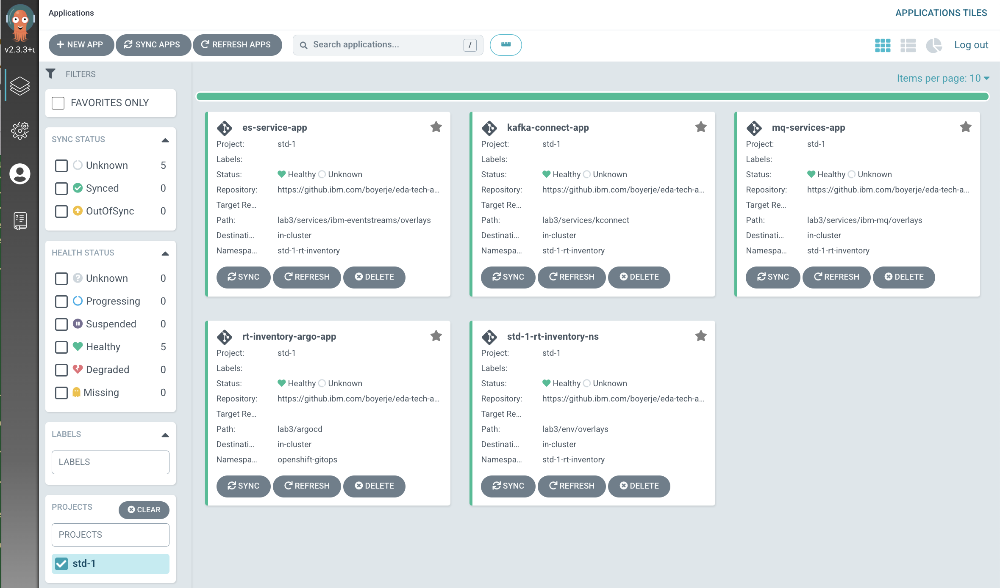

# GitOps deployment with Day 2 operations

In this exercise, you will use GitOps to deploy ArgoCD apps that monitor your git repository for any configuration changes and 
then apply those changes to the deployed applications.

The figure below illustrates the components involved:


As stated before you need to have forked this repository under your own account, as all configurations will be monitored from this git repository.
## Preparation

As we are using GitOps, you need to have the source of the configuration into your own account.

1. Verify the OpenShift GitOps Operator is installed on your OpenShift cluster.

    Work in the `eda-tech-academy/lab3` folder.

    ```sh
    make verify-argocd-available
    ```

    Should get this output if not installed

    ```sh
    Installing
    Complete
    ```

    Or this one if already installed.

    ```sh
    openshift-gitops-operator Installed
    ```

1. Prepare the ArgoCD app and project: Each student will have his/her own project within ArgoCD.

    * **Automatic way:**

    ```sh
    export $PREFIX=std-1
    export $GIT_ACCOUNT=yourname
    # same exported variables as before
    make prepare-argocd
    ```

    * Manual way: update the namespace, project, and repoURL elements in the `argocd/*.yaml` files.

1. To get the ArgoCD `admin` user's password use the command

    ```sh
    oc extract secret/openshift-gitops-cluster -n openshift-gitops --to=-
    ```

1. Get the ArgoCD User Interface URL and open a web browser

    ```sh
    chrome https://$(oc get route openshift-gitops-server -o jsonpath='{.status.ingress[].host}'  -n openshift-gitops)
    ```

1. Verify project created

    

1. Set project to your ArgoCD project

    

1. Commit and push your changes to your gitops repository

    ```sh
    git commit -am "update configuration for my student id"
    git push 
    ```

1. Bootstrap Argocd:  

    ```sh
    make argocd
    # Or use 
    oc apply -k argocd/
    ```

1. Verify in the ArgoCD console the apps are started and process the synchronization.

    


