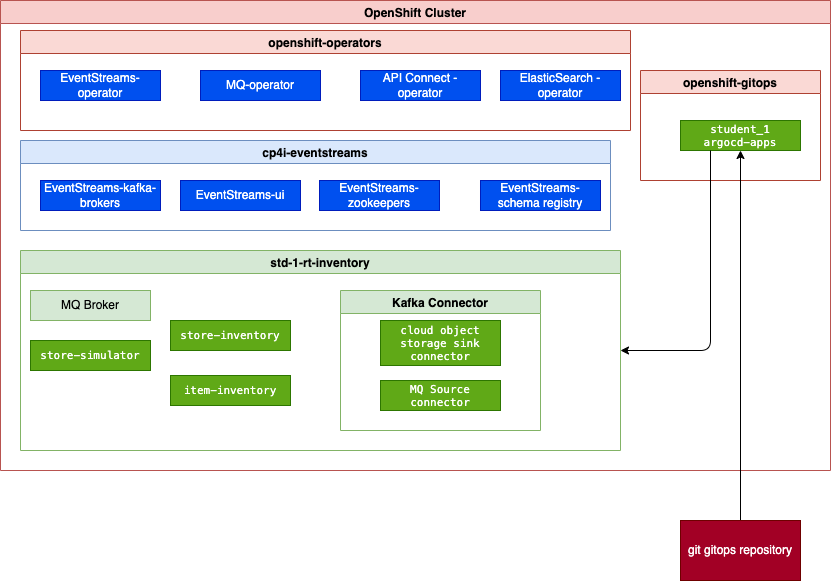
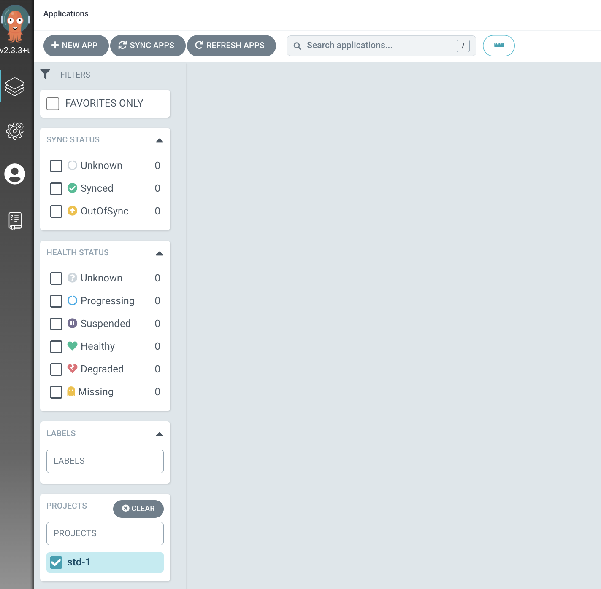

# GitOps deployment with Day 2 operations

In this exercise, you will use GitOps to deploy ArgoCD apps that monitor your git repository for any configuration changes you are doing via Pull Request or Git Commit operations and then apply those changes to the deployed applications.

The figure below illustrates the components involved:



In this lab the operators are already installed in the OpenShift cluster under the `openshift-operators` project, and products are already install too. So this lab is aimed to deploy the components of the real-time inventory demo (the green components in figure above).

As stated before you need to fork this repository under your own public git account, as all configurations will be monitored from your own git repository.
## Preparation

1. Verify the OpenShift GitOps Operator is installed on your OpenShift cluster. In fact it should be installed, but this command may be helpful to you in your future proof of concepts.

    Work in the `eda-tech-academy/lab3-4` folder.

    ```sh
    make verify-argocd-available
    ```

    Should get this output if not installed

    ```sh
    Installing
    Complete
    ```

    Or this one if already installed.

    ```sh
    openshift-gitops-operator Installed
    ```

1. Prepare the ArgoCD app and project: Each student will have his/her own project within ArgoCD.

    * **Automatic way:**

    ```sh
    # under the lab3-4 folder
    export PREFIX=poe10
    export GIT_ACCOUNT=yourname
    # same exported variables as before
    make prepare-argocd
    ```

    * Manual way: update the namespace, project, and repoURL elements in the `argocd/*.yaml` files.

1. To get the ArgoCD `admin` user's password use the command

    ```sh
    oc extract secret/openshift-gitops-cluster -n openshift-gitops --to=-
    ```

1. Get the ArgoCD User Interface URL and open a web browser

    ```sh
    chrome https://$(oc get route openshift-gitops-server -o jsonpath='{.status.ingress[].host}'  -n openshift-gitops)
    ```

1. Verify project created

    

1. Set project to your ArgoCD project

    

1. Commit and push your changes to your gitops repository (The fork for eda-tech-academy)

    * You can add a remote URl by replacing with your username in git.

    ```sh
    git remote add mine https://github.com/<yourusername>/eda-tech-academy.git
    ```

    ```sh
    git commit -am "update configuration for my student id"
    git push -u mine
    ```

1. Bootstrap Argocd:  

    ```sh
    make gitops
    ```

1. Verify in the ArgoCD console the apps are started and process the synchronization.

    

## Demonstration

You should be in the same state as in Lab 3 with the Simulator, the two kafka streams app, MQ and Kafka Connect

```sh
oc get pods
```

## Clean up

1. If you plan to do the lab 4 using gitops do not delete anything

1. Full clean up the deployment

    If you want to stop working and clean the OpenShift cluster and event streams elements

    ```sh
    make clean-gitops
    ```